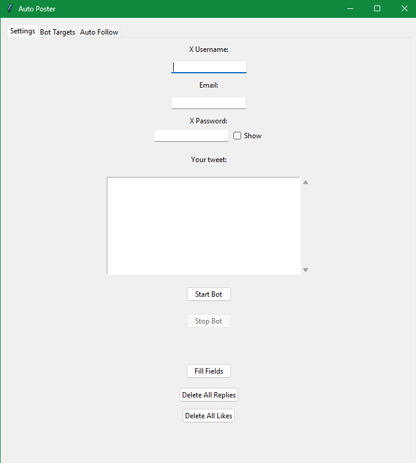
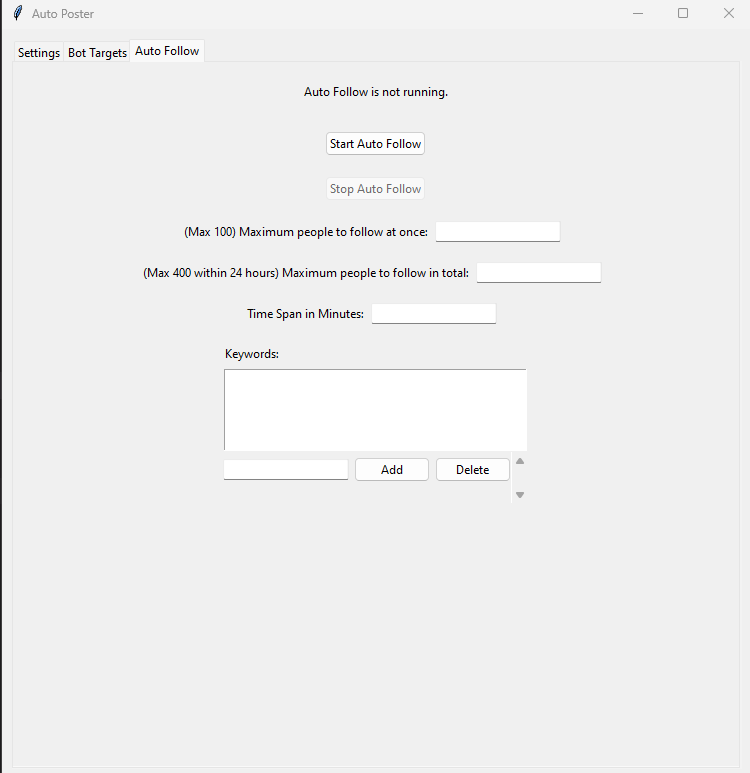

# Auto Poster  

The goal of this app is to drive more views to our X profile/account.  

How? 
1. Follow other accounts
2. By replying to all the posts of the other accounts that I'm following. 

Outcome/Result: 
1. This way, when I reply to their posts it will lead to other visitors to their accounts that are seeing those original posts to also view my reply (which is my post). 
2. This leads to increasing my profile views- which was the objective as mentioned in the Goal.

## Notes
The X account you use must not have any verification, otherwise the bot will not work.

## Features of the app
This Auto Poster app displays a UI which enables the user to choose what they want to do. This Auto Poster app performs these automated actions on X:

2. Replies and likes to the latest tweets of the accounts that the user is following and the accounts that the user adds (triggered by the Start Bot button in the Settings tab)

3. Deletes the replies and likes that the bot made (triggered by the Delete All Replies and Delete All Likes buttons in the Settings tab)

4. Retrieves the latest accounts that the user is following (triggered by the Get Following button in the Bot Targets tab)

5. Enables the user to add accounts to the bot targets tab (triggered by the Add button in the Bot Targets tab)

1. Follows other accounts (triggered by the Start Auto Follow button in the Auto Follow tab)

### Screenshots of the app
The Settings tab: 
The Bot Targets tab: 
The Auto Follow tab: 

## Features of the app explained in detail

### Settings tab
Start Bot button - When the user clicks on Start bot, the app will start replying and liking the latest tweets (on X) of the accounts that the user is following and the accounts that the user adds (it will only reply to those accounts that have the Reply checkbox checked). If the accounts from the user's following haven't been fetched yet, it does that and displays the fetched accounts in the Following list. The message that the bot will use to reply will be given by the user in the message box in the UI.

Stop Bot button - There's a Stop bot button which stops the bot. The user can click this button when they want to stop the bot.

Fill Fields button - There's a Fill Fields button. When the user clicks on this button, the app will fill the username, password and email fields with the user's X username, password and email. This is fetched from a SQL database.

Delete all replies and Delete all likes - There are 2 buttons: Delete all replies and Delete all likes. The user can click on these buttons to delete all the replies and likes that the bot has made on X (formerly Twitter). Currently, the Delete all likes button is not working as expected.

### Bot Targets tab
"Get Following" button - When the user clicks on the "Get Following" button, the app will start fetching the accounts that the user is following on X and display them in the following list. Beside each account name, 2 checkboxes will be present: See tweet and Reply. If the Reply checkbox is checked, that means that the bot will reply to the latest tweet of the corresponding account. If the See tweet checkbox is checked, that means that the bot won't reply to the latest tweet of the corresponding account, but will just like it.

Delete button - When the user clicks the Delete button, the selected account will be deleted from the Added people.

Add button - When the user clicks the Add button, they will be prompted to enter an X username. The bot will then find the associated user on X and add them to the Added list on the right. Beside the account name, 2 checkboxes will be present: See tweet and Reply. If the Reply checkbox is checked, that means that the bot will reply to the latest tweet of that account. If the See tweet checkbox is checked, that means that the bot won't reply to the latest tweet of that account, but will just like it.

### Auto Follow tab
Start Auto Follow button - When the user clicks on the Start Auto Follow button, the app will start following X accounts based on the following inputs. The app will follow accounts in batches within the time span mentioned below. Between these batches, there will be rest periods. The maximum accounts that can be followed in a single batch is mentioned in the "follow at once" field below. The maximum number of accounts that can be followed in total is mentioned in the "follow in total" field below. The accounts that will be followed will be those accounts that have the mentioned keywords in their bio. If there are no keywords mentioned, then all the accounts that the bot can follow will be followed.

Stop Auto Follow button - When the user clicks on the Stop Auto Follow button, the bot will stop following the accounts.

Maximum people to follow at once - The number of accounts that the bot will follow at a time in a single batch. The maximum number of accounts that the bot can follow at once is 100.

Maximum people to follow in total - The maximum number of accounts that the bot will follow in the time span mentioned below. The maximum number of accounts that the bot can follow in total is 400.

Time span in Minutes - The time span for which the bot will follow the accounts. The time span is given in minutes.

Add button (below the Keywords list) - When the user clicks on the Add button, they will be prompted to enter a keyword. The keyword will be added to the Keywords list.

Delete button (below the Keywords list) - When the user clicks on the Delete button, the selected keyword will be deleted from the Keywords list.