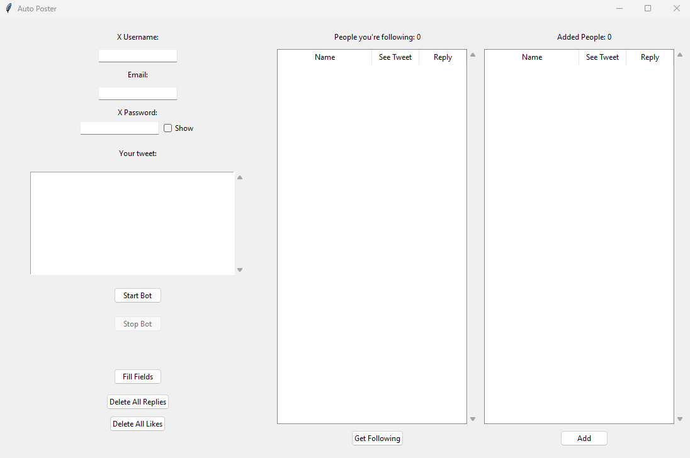

# Auto Poster  

The goal of this app is to drive more views to our X profile/account.  

How? 
1. Follow other accounts
2. By replying to all the posts of the other accounts that I'm following. 

Outcome/Result: 
1. This way, when I reply to their posts it will lead to other visitors to their accounts that are seeing those original posts to also view my reply (which is my post). 
2. This leads to increasing my profile views- which was the objective as mentioned in the Goal.

## Notes
The X account you use must not have any verification, otherwise the bot will not work.

## How does this app work
This Auto Poster app displays a UI which enables the user to choose what they want to do. This is how the UI looks currently:

For the user to start using the app, they need to input their X username, password and email. 

When the user clicks on the "Get Following" button, the app will start fetching the accounts that the user is following and display them in the following list. Beside each account name, 2 checkboxes will be present: See tweet and Reply. If the Reply checkbox is checked, that means that the bot will reply to the latest tweet of the corresponding account. If the See tweet checkbox is checked, that means that the bot won't reply to the latest tweet of the corresponding account, but will just like it.

When the user clicks on Start bot, the app will start replying and liking the latest tweets of the accounts that the user is following (it will only reply to those accounts that have the Reply checkbox checked). If the accounts haven't been fetched yet, it does that and displays the fetched accounts in the Following list.The message that the bot will use to reply will be given by the user in the message box in the UI.

When the user clicks the Add button, they will be prompted to enter an X username. The bot will then find the associated user on X and add them to the Added list on the right. Beside the account name, 2 checkboxes will be present: See tweet and Reply. If the Reply checkbox is checked, that means that the bot will reply to the latest tweet of that account. If the See tweet checkbox is checked, that means that the bot won't reply to the latest tweet of that account, but will just like it.

Below the "Start bot" button, there will be a Stop bot button which stops the bot. The user can click this button when they want to stop the bot.

Below the Stop bot button, there are 2 buttons: Delete all replies and Delete all likes. The user can click on these buttons to delete all the replies and likes that the bot has made. Currently, the Delete all likes button is not working as expected.
